# ModelScope BIM Workspace

ModelScope is a viewport-first BIM review prototype for AI-assisted model and drawing coordination.

AI proposes findings. A reviewer decides what becomes a confirmed issue.

It is a code-first product interface prototype built with React, TypeScript, Tailwind CSS, shadcn/ui, and Supabase-backed persistence for supported review data. It is not a production BIM renderer, IFC parser, or real AI detection engine.

[](https://postimg.cc/K18C678V)
[](https://postimg.cc/TydB7DPR)

_Drawing Triage workspace with a sample 2D floor plan, candidate review markers, and reviewer-controlled AI observation cards._

<br>

**Live demo:** https://modelscope-bim-workspace.vercel.app/  
**Code:** https://github.com/ilukin89/modelscope-bim-workspace

---

## What is built vs mocked

### Built and working

- React / TypeScript frontend prototype
- viewport-first BIM review workspace UI
- Model Review workflow
- Drawing Triage workflow
- AI finding and candidate review flows
- candidate-to-issue conversion
- local issue lifecycle and outcome handling
- Supabase-backed persistence layer for supported review data
- project-scoped persisted review state, where implemented
- persisted review decisions and created issues, where implemented
- source traceability from issue back to AI finding or drawing candidate
- viewport / inspector / review panel state synchronization
- responsive workspace behavior
- WCAG-oriented accessibility polish pass
- spec-driven documentation workflow

### Mocked intentionally

- AI scan results
- BIM model data
- 2D drawing observations, unless replaced by persisted demo data in the current Supabase flow
- simulated viewport rendering
- demo access / portfolio gate behavior

### Not implemented yet

- real IFC upload
- real BIM parsing
- real geometry loading
- real AI inference
- real production file upload flow
- full multi-user auth and permissions
- team collaboration
- production BIM viewer integration
- production-grade issue management

These limitations are intentional. ModelScope is designed as a credible product prototype, not as a fake full BIM platform.

---

## Current Status

ModelScope is currently a code-first product prototype with a React / TypeScript frontend and a Supabase-backed persistence layer for supported review data.

It demonstrates:

- AI-assisted review workflows
- reviewer-controlled decision-making
- issue creation from AI findings and drawing candidates
- issue traceability
- lightweight issue outcome handling
- persisted review state, where implemented
- responsive BIM-style workspace UI
- prototype honesty around mocked capabilities

It does not claim to support real BIM processing, real AI detection, full production collaboration, or production-grade BIM viewer integration.

---

## Main Workflows

### Model Review

The Model Review workflow lets the user inspect AI findings in a model-oriented workspace.

Current flow:

```txt
Select project
→ navigate model
→ inspect object
→ run AI scan
→ review AI findings
→ preview proposed change
→ create issue
→ manage issue outcome
→ return to model context
```

Implemented Model Review behaviors include:

- project-based workspace entry
- floor and layer navigation
- object inspection
- AI Review panel
- AI finding selection
- viewport markers and highlighting
- preview change flow
- issue creation from AI findings
- issue traceability through `sourceFindingId`
- issue history entries
- `View in model`
- `View issue details`
- issue lifecycle and outcome handling
- persisted review state, where supported by the current Supabase implementation

---

### Drawing Triage

The Drawing Triage workflow lets the user review AI-generated observations on 2D drawings.

Current flow:

```txt
Enter Drawing Triage
→ load/select drawing
→ select sheet
→ run triage
→ review candidates
→ convert to issue / dismiss / mark follow-up
→ track created issues
→ return to source region on sheet
```

Implemented Drawing Triage behaviors include:

- supported-project entry gate
- sample drawing / mock file flow
- sheet selection
- triage scanning state
- candidate review queue
- candidate type filters:
  - Clearance
  - Annotation
  - Coordination
- candidate selection
- region/source highlighting
- convert to issue
- dismiss
- follow-up flag
- compact Created issues sub-view
- `View on sheet` source traceability
- persisted review data, where supported by the current Supabase implementation

---

## AI Proposes, Reviewer Decides

ModelScope separates AI output from confirmed issues.

### AI output

AI findings and candidates are treated as review inputs.

They may include:

- confidence
- source context
- viewport or drawing location
- suggested action
- review priority

### Reviewer decision

Only the reviewer can decide whether an AI output becomes an issue.

The reviewer can:

- create an issue
- dismiss the finding or candidate
- mark it for follow-up
- preview the proposed change before acting

This prevents the UI from implying that AI output is automatically true.

---

## Model Review Issue Flow

Model Review issues are created from AI findings.

Each issue preserves traceability back to the AI source finding.

```txt
AI finding
→ Create issue
→ Issues tab
→ View in model
→ Status / outcome action
→ History entry
```

### Current issue lifecycle

```txt
Open
→ In Review
→ Resolved
```

### Additional issue outcomes

ModelScope also supports lightweight issue outcomes:

```txt
Blocked
Closed as not actionable
Reopen issue
Return to review
Remove issue
```

These outcomes make the flow more realistic without turning the prototype into a full issue-management system.

---

## Drawing Triage Issue Flow

Drawing Triage issues are created from drawing candidates.

The flow is intentionally lighter than Model Review issue management.

```txt
AI candidate
→ reviewer decision
→ convert to issue / dismiss / follow-up
→ Created issues sub-view
→ View on sheet
```

Created Drawing Triage issues preserve the source candidate and allow the reviewer to return to the exact sheet context.

---

## Product Principles

### 1. AI is not the source of truth

AI findings are provisional. The reviewer decides what becomes actionable.

### 2. No silent promotion

A candidate or finding cannot become an issue automatically. Issue creation is always explicit.

### 3. Every action needs a visible consequence

If the UI offers an action, the user should see a result in the viewport, sheet, inspector, issue list, or history.

### 4. Prototype honesty matters

The project does not claim to support real IFC, real BIM parsing, or real AI detection.

Mocked interactions are allowed. Fake capability claims are not.

### 5. Lightweight issue tracking beats fake enterprise bloat

ModelScope is not trying to recreate Jira, Revizto, or a full coordination platform.

The goal is to demonstrate a believable review workflow with the right level of complexity.

### 6. Persistence follows the workflow

Persistence is added where the review workflow needs it: project-scoped state, review decisions, created issues, and traceability.

The backend should support the review model instead of turning the prototype into a premature enterprise system.

---

## Architecture Notes

ModelScope uses frontend and backend architecture boundaries to keep the prototype maintainable.

### Viewer boundary

The viewport visualizes product state, but it should not own product workflow logic.

The intended direction is:

```txt
UI state / workflow logic
→ viewer adapter boundary
→ viewport visualization
```

This keeps issue lifecycle logic separate from rendering concerns.

---

### Type separation

The project separates AI findings from confirmed issues.

```txt
ReviewIssue
≠
ModelReviewIssue
```

A `ReviewIssue` represents an AI finding or review candidate.

A `ModelReviewIssue` represents a confirmed issue created by the reviewer.

This prevents accidental silent promotion of AI output into tracked issues.

---

### State scoped per project

Model Review state is scoped per project.

```txt
Record<ProjectId, ProjectAiReviewState>
```

This allows project-specific review work to remain isolated instead of collapsing into one global state.

---

### Supabase persistence boundary

ModelScope uses Supabase-backed persistence for supported review data.

The persistence layer is intended to support:

- project-scoped review state
- saved review decisions
- created issues
- issue lifecycle state
- source traceability from confirmed issue back to AI finding or drawing candidate

The backend boundary is deliberately narrower than a full BIM platform. It supports the portfolio prototype's review workflows without claiming production-grade BIM processing, real AI inference, or enterprise collaboration.

---

### Drawing Triage session and persistence boundary

Drawing Triage started with session persistence to preserve review progress during a browser session.

The current direction is to move supported review data into the Supabase-backed persistence layer while keeping AI observations, drawing content, and BIM processing clearly marked as mocked unless implemented.

This makes the prototype feel credible without pretending that real drawing analysis or production upload processing already exists.

---

## UX Flow Map

```mermaid
flowchart TD

  %% =========================
  %% MODEL REVIEW
  %% =========================
  subgraph MR[Model Review]
    MR1[Workspace entry<br/>Select project · workspaceMode = model-review]
    MR2[Navigate model<br/>Floors · layers · explorer · viewport]
    MR3[Inspect object<br/>Properties · Issues · AI Review · History]
    MR4[AI scan<br/>scanning → scanned_with_findings]
    MR5[Findings + markers<br/>AI findings list · viewport markers]
    MR6[Select finding<br/>confidence · suggestion · source context]
    MR7[Preview change<br/>visible proposed change in viewport]
    MR1 --> MR2 --> MR3 --> MR4 --> MR5 --> MR6 --> MR7
  end

  %% =========================
  %% DRAWING TRIAGE
  %% =========================
  subgraph DT[Drawing Triage]
    DT1[Entry gate<br/>Mode switch · supported project guard]
    DT2[Load drawing<br/>Sample drawing or mock file]
    DT3[Select sheet<br/>Level 01 · Level 02 · Roof]
    DT4[Run triage<br/>scanning → review]
    DT5[Candidate queue<br/>Clearance · Annotation · Coordination]
    DT6[Select candidate<br/>confidence · region · review priority]
    DT7[Created issues sub-view<br/>Review candidates / Created issues]
    DT1 --> DT2 --> DT3 --> DT4 --> DT5 --> DT6 --> DT7
  end

  %% =========================
  %% REVIEWER DECISION
  %% =========================
  GATE[Reviewer decision<br/>AI suggests → reviewer decides<br/>No silent promotion]

  MR7 --> GATE
  DT6 --> GATE

  GATE --> ACT1[Create issue]
  GATE --> ACT2[Follow-up]
  GATE --> ACT3[Dismiss]

  %% =========================
  %% MODEL REVIEW ISSUE FLOW
  %% =========================
  subgraph MRO[Model Review issue flow]
    MRO1[Issue created<br/>Appears in Issues tab]
    MRO2[Traceability<br/>sourceFindingId preserved]
    MRO3[Viewport actions<br/>View in model · Hide from model]
    MRO4[Issue details focus<br/>View issue details]
    MRO5[Lifecycle<br/>Open → In Review → Resolved]
    MRO6[Additional outcomes<br/>Blocked · Closed as not actionable]
    MRO7[Recovery actions<br/>Reopen · Return to review]
    MRO8[Remove issue<br/>Local tracker cleanup]
    MRO9[History events<br/>Key actions recorded]
    MRO1 --> MRO2 --> MRO3 --> MRO4 --> MRO5
    MRO5 --> MRO6
    MRO6 --> MRO7
    MRO7 --> MRO8
    MRO8 --> MRO9
  end

  ACT1 --> MRO1

  %% =========================
  %% DRAWING TRIAGE ISSUE FLOW
  %% =========================
  subgraph DTO[Drawing Triage issue flow]
    DTO1[Issue created<br/>Appears in Created issues sub-view]
    DTO2[Source traceability<br/>Candidate remains linked]
    DTO3[View on sheet<br/>Returns to source region]
    DTO4[Follow-up flag<br/>Lightweight review marker]
    DTO5[Local created issue tracker<br/>Compact cards]
    DTO1 --> DTO2 --> DTO3 --> DTO4 --> DTO5
  end

  ACT1 --> DTO1
  ACT2 --> DTO4
  ACT3 --> DTO5

  %% =========================
  %% ARCHITECTURE / PRODUCT CONSTRAINTS
  %% =========================
  subgraph ENG[Architecture / Product constraints]
    ENG1[ReviewIssue ≠ ModelReviewIssue<br/>Explicit promotion required]
    ENG2[State scoped per project<br/>Record<ProjectId, ProjectAiReviewState>]
    ENG3[Supabase-backed persistence<br/>Supported review data]
    ENG4[Viewport consequence principle<br/>User actions should produce visible feedback]
    ENG5[Prototype honesty<br/>No fake real BIM / IFC / AI claims]
  end
```



---

## Tech Stack

- Vite
- React
- TypeScript
- Tailwind CSS
- shadcn/ui
- Radix UI
- Lucide icons
- Supabase

---

## Local Development

### Install dependencies

```bash
npm install
```

### Start development server

```bash
npm run dev
```

### Build

```bash
npm run build
```

---

## Project Structure

```txt
src/
  components/
  data/
  features/
    drawing-triage/
    object-inspector/
    viewport/
  hooks/
  lib/
  types.ts
```

The project is organized by product feature area instead of treating the app as a flat UI playground.

---

## Next Milestone

The next milestone is to extend the implemented Supabase foundation toward the next real product boundary:

- real drawing upload flow
- stronger project/document persistence
- persisted drawing review sessions, where not yet covered
- clearer demo user / auth boundary
- source traceability from confirmed issue back to finding or candidate
- real AI integration only after the review workflow and persistence model stay stable

Real AI integration should come after the review workflow, storage boundary, and review decision model are validated.

---
